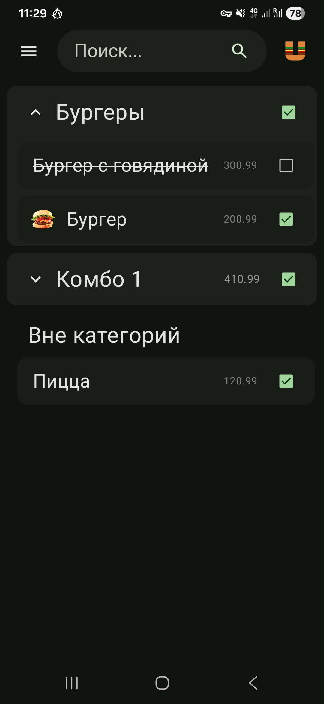
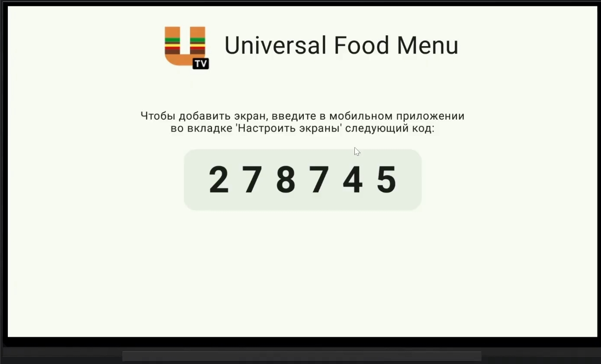
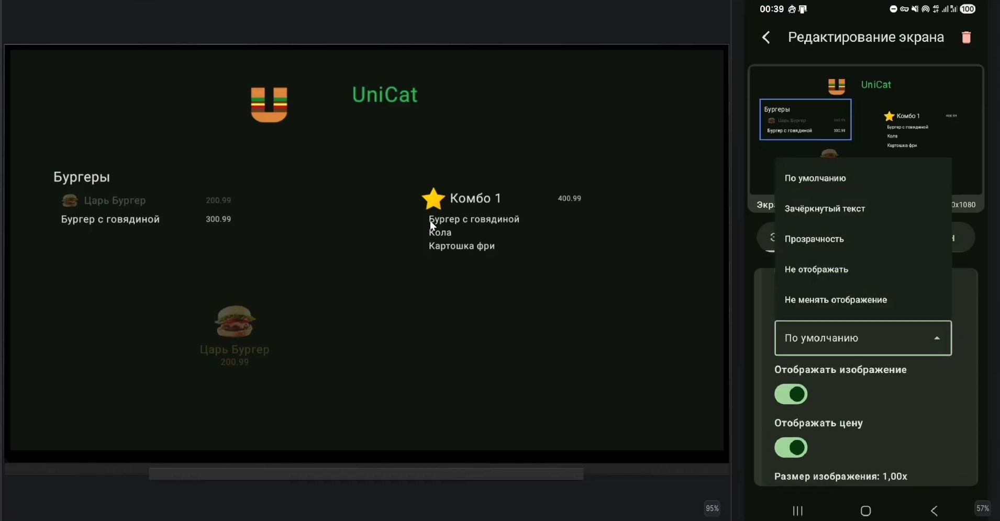
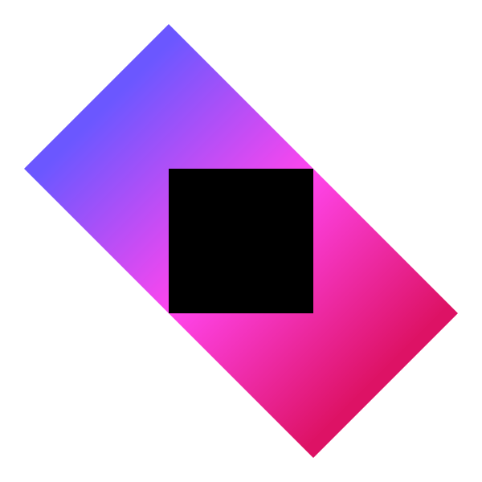
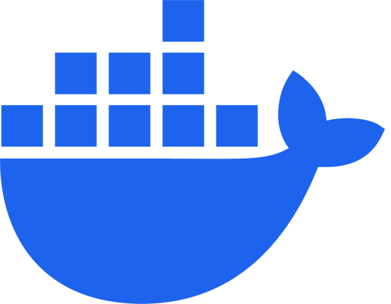
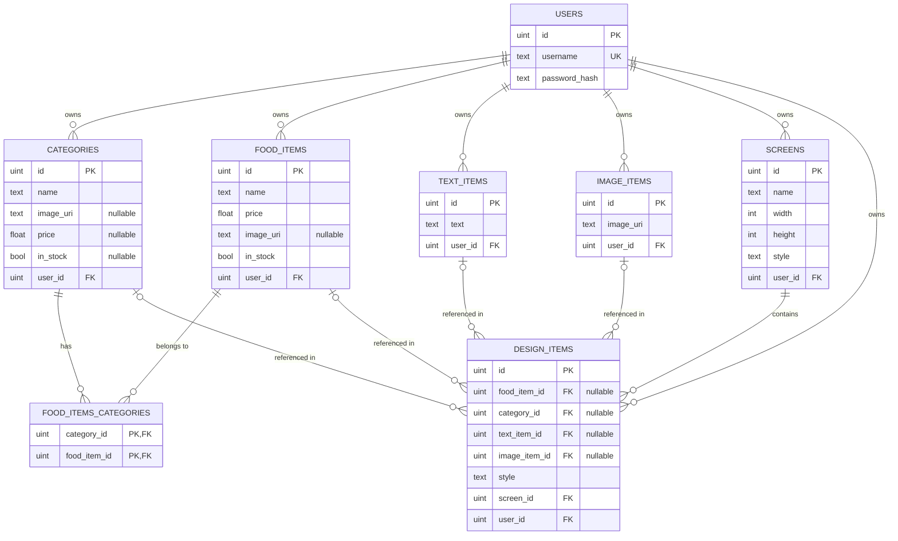

#  Universal food menu
### Mobile app to display the food menu on the TV 🍔
<details><summary>Screenshots</summary>
<p>Mobile app</p>

<p>Code for connect TV screen</p>

<p>TV and design editor</p>

</details>

##  Demo video

http://www.youtube.com/watch?v=qaltowj_-7A

[](http://www.youtube.com/watch?v=qaltowj_-7A "Demo video")

## Architecture

### Backend
*  Kotlin
*  Ktor - REST API server, use websocket for sending events of changing data. For authorization using JWT tokens.
* Database -  PostgreSQL
* DI -  Koin
*  Docker

### Frontend (Mobile app & Android TV app)
* Clean arch, MVVM
*  Jetpack Compose
*  Ktor client
* DI - Dagger Hilt 2

## Data-scheme

### Database scheme


### Style JSON
The styles are inspired by CSS and are stored in JSON format like that:

```json
{
  "x": 100.5,
  "y": 250.0,
  "scale": 1.0,
  "notInStockStyle": "OPACITY",
  "textColorHex": "#FF5733",
  "showImage": true,
  "showPrice": false,
  "foodItemDisplayTypeStyle": {
    "type": "row"
  },
  "imageScale": 1.2,
  "itemWidthScale": 0.9,
  "categoryItemStyle": {"notInStockStyle":"CROSSED_OUT","textColorHex":"#000000","showImage":false,"showPrice":true,"foodItemDisplayTypeStyle":{"type":"cell"}}
}
```

## Launch

Backend server  docker image: https://hub.docker.com/r/kalashnik/ufm-server

APKs added to release
